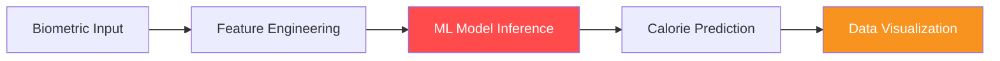

# 💪 AI-Powered Fitness Tracker

<div align="center">
  
  
  
</div>

<br />

A data-driven fitness application that uses Machine Learning to predict calories burned based on user biometrics and activity duration.

---

## 🧪 Model Workflow



---

## 📈 Features
- **🔥 Accurate Predictions**: Estimate energy expenditure using trained regression models.
- **👤 Personalized Profile**: Calculations tailored to age, gender, BMI, and heart rate.
- **📊 Insightful Visuals**: Interactive charts showing activity trends and health metrics.
- **⚡ Reactive UI**: Fast and intuitive web interface powered by Streamlit.

## 🧠 Tech Stack
- **Languages**: `Python`
- **Libraries**: `Scikit-learn`, `Pandas`, `Matplotlib`, `NumPy`
- **Framework**: `Streamlit`

## 🚀 Getting Started
1. **Clone the repo**:
   ```bash
   git clone https://github.com/Kodge0001/fitness.git
   ```
2. **Install requirements**:
   ```bash
   pip install -r requirements.txt
   ```
3. **Run the app**:
   ```bash
   streamlit run app.py
   ```

---
*Developed by [Anurag Kodge](https://github.com/Kodge0001)*
